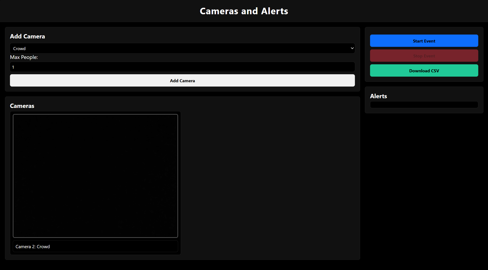
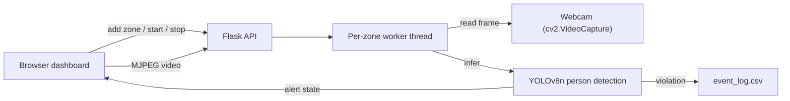

# Event Detect

A real-time event-safety dashboard that runs YOLOv8 person detection on a live camera feed to flag restricted-area intrusions and crowd-limit violations.



## What it does

Event Detect is a web dashboard for monitoring a venue's camera feed during an event. You add one or more detection "zones," each set to either **Restricted** mode (alert the moment any person is detected) or **Crowd** mode (alert once the person count passes a configurable limit), then hit Start. Each zone streams live video, runs YOLOv8n inference on it in the background, raises an on-screen alert on violation, and logs a timestamped row to a CSV audit trail you can download once the event ends.

## Features

- Any number of independently configured detection zones running against a live feed
- Two alert modes: hard restricted-area intrusion detection, and configurable crowd-size thresholds
- Live MJPEG video preview per zone that highlights red on violation
- Real-time alert feed in the dashboard (polled every second)
- Automatic, timestamped CSV audit log, downloadable after the event

## How it works



Each zone runs on its own background thread: read a frame, run YOLOv8n, check it against that zone's rule, cache the annotated result, repeat. The Flask process just serves whatever each thread's latest frame/alert state is — it never blocks a request on inference.

## Key technical decisions

- **One webcam, many zones.** There's a single `cv2.VideoCapture(0)` opened once, shared by every zone. Adding a zone doesn't open a new capture device — it spawns a worker thread that reads the same feed and runs its own YOLO pass with its own rule. This lets you test multiple detection rules against one feed in parallel without needing multiple physical cameras; wiring in separate camera/RTSP sources per zone is the natural next step (see below).
- **YOLOv8n over a larger model.** The nano variant trades detection accuracy for speed, so inference can run on every frame on a CPU, in real time, without a GPU.
- **Downscaled inference.** Frames are resized to 320×320 before being handed to the model, cutting inference latency further at the cost of range/accuracy on small or distant people.
- **Decoupled capture and streaming.** Each worker thread stashes its latest JPEG-encoded frame on the zone's state; the `/video_feed/<id>` MJPEG endpoint just serves whatever's cached rather than reading the capture itself. This keeps multiple concurrent browser viewers from contending over the single `VideoCapture` object.
- **Polling over push for alerts.** The frontend polls `/alerts` once a second rather than using WebSockets/SSE — simpler to implement and debug, at the cost of up to a second of alert latency.

## Tech stack

| Layer | Choice |
|---|---|
| Backend | Flask |
| Computer vision / ML | Ultralytics YOLOv8 (`yolov8n.pt`), OpenCV |
| Concurrency | Python `threading` — one worker thread per zone, a `Lock` guarding shared state |
| Storage | In-memory zone state; CSV file (`event_log.csv`) for the audit log |
| Frontend | Server-rendered Jinja templates, vanilla JS/CSS (no framework, no build step) |

## Getting started

Requirements: Python 3.9+, a webcam at device index 0.

```bash
pip install flask opencv-python numpy ultralytics
python app.py
```

Then open `http://127.0.0.1:5000/`. On first run, `ultralytics` will download `yolov8n.pt` automatically.

## Limitations & what I'd build next

- **Multi-camera support.** Every zone currently reads the same physical webcam rather than an independent source. Adding a per-zone source (device index, RTSP URL, or video file) would be a next step.
- **CSV logging is edge-triggered, not continuous.** A row is written when a violation starts, not on every frame it remains true, so it reads as discrete events rather than a full time series of counts. That's the intended behavior, but could be improved for finer-grained analytics.
